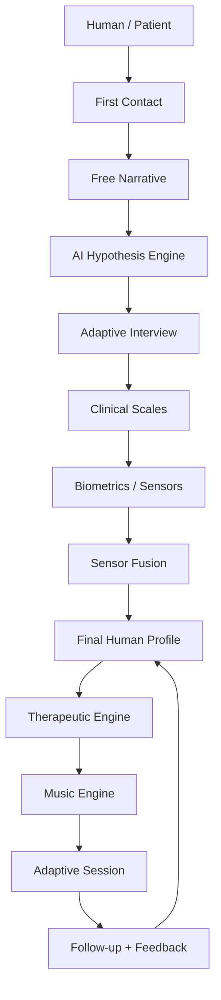

# NIROS — Research Operating System

> Foundation Release v4. This is the stable map of the project. Do not rebuild the foundation unless there is a serious architectural reason.

## Main navigation

| Area                                                     | Purpose                                                               |
| -------------------------------------------------------- | --------------------------------------------------------------------- |
| [[01_Vision/00_Vision_Index]]                            | Why NIROS exists and what boundaries it must respect                  |
| [[02_Science/00_Science_Index]]                          | Scientific foundations and evidence standards                         |
| [[03_Knowledge_Base/00_Knowledge_Base_Index]]            | RAG, papers, source quality, research ingestion                       |
| [[04_Human_Understanding_Engine/00_HUE_Overview]]        | Voice intake, adaptive interview, hypothesis engine, sensors, profile |
| [[05_Therapeutic_Engine/00_Therapeutic_Engine_Overview]] | Therapeutic planning and intervention logic                           |
| [[06_Music_Engine/00_Music_Engine_Overview]]             | Music generation and adaptive session soundtrack                      |
| [[07_AI_Core/00_AI_Core_Overview]]                       | Orchestration, memory, model routing, safety wrappers                 |
| [[08_Sensors/00_Sensors_Overview]]                       | Wearables and physiological data layer                                |
| [[09_Clinical_Protocols/00_Clinical_Protocols_Overview]] | Protocol families and target domains                                  |
| [[10_Safety_and_Ethics/00_Safety_Ethics_Overview]]       | Boundaries, consent, escalation, explainability                       |
| [[11_Validation/00_Validation_Overview]]                 | Testing, metrics, evidence, clinical review                           |
| [[12_SDK_and_API/00_SDK_API_Overview]]                   | Schemas and developer interfaces                                      |
| [[16_Development/01_Cursor_Workflow]]                    | Cursor instructions                                                   |
| [[19_Inbox/00_Capture_Rules]]                            | How new ideas enter the system                                        |

## System overview

## Current build priority

1. Human Understanding Engine MVP
2. Adaptive Interview Engine
3. Problem Validation + Risk Assessment
4. Structured Profile JSON
5. Cursor-readable code scaffolding
6. Music Engine prototype
7. Sensor Fusion later, after the interview logic is stable
