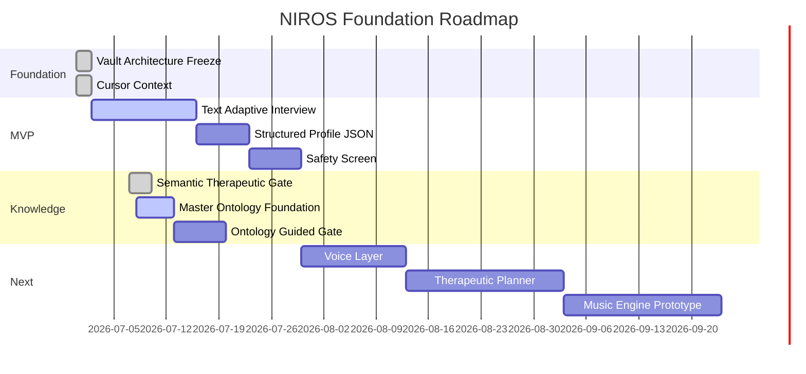

# NIROS Roadmap

## Status dashboard

| Phase |                    Name | Status  | Goal                                       |
| ----- | ----------------------: | ------- | ------------------------------------------ |
| 0     |  Research OS Foundation | Stable  | Freeze architecture and rules              |
| 1     | Human Understanding MVP | Next    | Text interview + structured profile        |
| 2     |     Voice Interview MVP | Planned | Speech-to-text and text-to-speech layer    |
| 3     |    AI Hypothesis Engine | Planned | Declared vs confirmed problem logic        |
| 4     |            Safety Layer | Planned | Risk screen, escalation, contraindications |
| 5     |      Therapeutic Engine | Planned | Target-based session planning              |
| 6     |            Music Engine | Planned | Music objectives, prompts, session blocks  |
| 7     |                 Sensors | Later   | HRV, EDA, sleep, voice features            |
| 8     |              Validation | Ongoing | Compare outputs against expert review      |

## Ontology-First Knowledge System

### Strategic shift

NIROS is moving from **book-first extraction** to **ontology-first knowledge**.

The previous direction relied too heavily on parsing large books and hoping AI would infer therapeutic meaning from raw text. That approach is fragile and tends to produce keyword-based extraction.

The new direction:

1. Human problems / presenting concerns
2. Underlying maintaining mechanisms
3. Therapeutic change processes
4. Psilocybin-relevant processes
5. Evidence / source mappings
6. Runtime knowledge outputs

Humans are often pattern-driven. NIROS should model recurring psychological patterns and mechanisms first, then use literature to **refine, validate, and expand** them — not invent structure from scratch.

The **Knowledge Compiler remains important**, but its role changes: it becomes a **verifier and enricher** of an existing ontology, not the primary source of structure.

### Master ontology map

```text
Problem / presenting concern
  ↓
Associated mechanisms
  ↓
Maintaining mechanisms
  ↓
Therapeutic change processes
  ↓
Psilocybin therapy relevance
  ↓
Ericksonian / language patterns
  ↓
Session support patterns
  ↓
Risks / contraindications
  ↓
Evidence / source references
  ↓
Runtime use
```

### Initial presenting-concern domains

These are **candidate presenting concerns** where psilocybin-assisted therapy may be relevant depending on evidence, mechanism, risk profile, and clinical context. They are **not claims that psilocybin cures these conditions**.

- depression
- anxiety
- trauma / PTSD
- alcohol use
- substance dependence
- nicotine dependence
- behavioral addictions
- chronic pain
- fibromyalgia
- shame
- self-criticism
- jealousy
- grief
- fear of death
- existential crisis
- emotional avoidance
- cognitive rigidity
- rumination
- low self-worth
- loss of meaning

### Example maintaining mechanisms

- experiential avoidance
- cognitive fusion
- emotional suppression
- shame sensitivity
- harsh self-criticism
- fear of abandonment
- control strategies
- rumination
- trauma memory loops
- pain catastrophizing
- central sensitization
- identity rigidity
- lack of meaning
- impaired self-compassion
- addictive relief cycle
- avoidance-reward loop

Each mechanism should eventually include:

- definition
- how it forms
- how it is maintained
- client signals
- associated problems
- therapeutic responses
- relevant therapy models
- psilocybin relevance
- session risk notes
- integration relevance
- evidence status
- source references
- human review status

Evidence status values:

- established
- emerging
- hypothetical
- unsupported
- contraindicated

### Sprint 030 — Knowledge System slices

| Slice | Name | Status | Goal |
| ----- | ---- | ------ | ---- |
| 12 | Semantic Therapeutic Relevance Gate | Done | Gate book chunks before extraction; skip keyword-only noise |
| 13 | Master Ontology Foundation | Active | Schema, loader, seed ontology JSON, validation tests |
| 14 | Ontology-Guided Semantic Gate | Planned | Use ontology context to classify chunks as confirm / nuance / new mechanism / irrelevant / keyword noise |

#### Slice 13 — Master Ontology Foundation

Goal: create the foundation for ontology-first NIROS without runtime integration.

Deliverables:

- `niros/master_ontology.py`
- `knowledge_library/master_ontology/*.json`
- validation tests
- seed examples only; no UI; no runtime wiring yet

Rules:

- do not remove the Knowledge Compiler
- do not change runtime yet
- do not change CTPC schema unless strictly needed
- keep ontology as a source/context layer for future compiler decisions

#### Slice 14 — Ontology-Guided Semantic Gate

Goal: make the semantic gate ontology-aware.

A book chunk should be classified as:

- confirms an existing mechanism
- adds a nuance
- describes a new mechanism
- is irrelevant
- is keyword-only noise

This slice builds on Slice 12 and Slice 13. It does not replace human review or consolidation.

## Roadmap graphic



## Anti-NASA rule

The project must not expand every time a new interesting idea appears. New ideas enter [[19_Inbox/00_Capture_Rules]] and are reviewed before they can change the permanent architecture.
