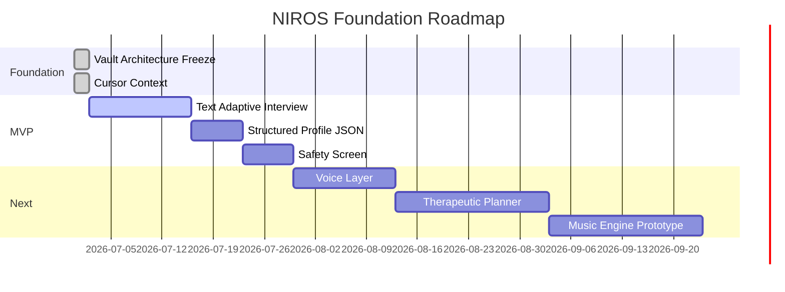

# NIROS Roadmap

## Status dashboard

| Phase |                    Name | Status  | Goal                                       |
| ----- | ----------------------: | ------- | ------------------------------------------ |
| 0     |  Research OS Foundation | Stable  | Freeze architecture and rules              |
| 1     | Human Understanding MVP | Next    | Text interview + structured profile        |
| 2     |     Voice Interview MVP | Planned | Speech-to-text and text-to-speech layer    |
| 3     |    AI Hypothesis Engine | Planned | Declared vs confirmed problem logic        |
| 4     |            Safety Layer | Planned | Risk screen, escalation, contraindications |
| 5     |      Therapeutic Engine | Planned | Target-based session planning              |
| 6     |            Music Engine | Planned | Music objectives, prompts, session blocks  |
| 7     |                 Sensors | Later   | HRV, EDA, sleep, voice features            |
| 8     |              Validation | Ongoing | Compare outputs against expert review      |

## Roadmap graphic

## Anti-NASA rule

The project must not expand every time a new interesting idea appears. New ideas enter [[19_Inbox/00_Capture_Rules]] and are reviewed before they can change the permanent architecture.
