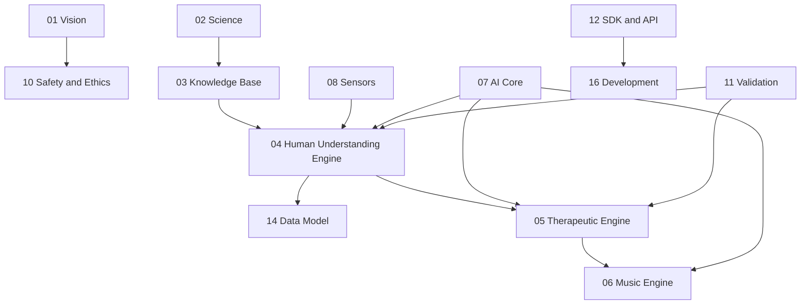
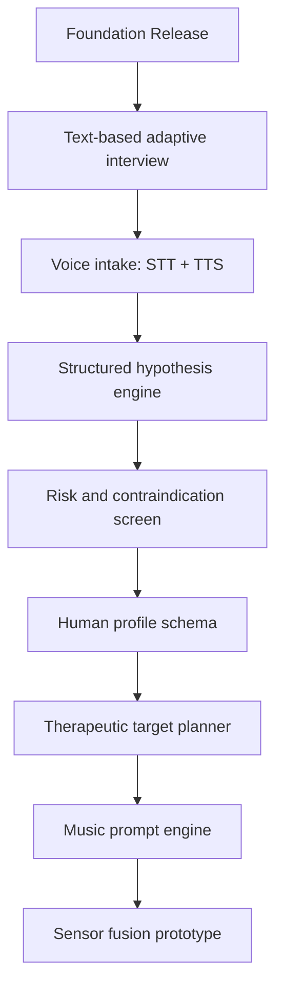

# NIROS System Map

## Patient lifecycle architecture

```mermaid
flowchart LR
    A[First Contact] --> B[Free Narrative]
    B --> C[Declared Problem]
    C --> D[Adaptive Interview]
    D --> E[Clinical Scales]
    E --> F[Risk Assessment]
    F --> G[Biometric Context]
    G --> H[Confirmed Therapeutic Targets]
    H --> I[Human Profile]
    I --> J[Therapeutic Plan]
    J --> K[Music / Session Design]
    K --> L[Session]
    L --> M[Post-session Integration]
    M --> N[Feedback + Learning]
```

## Module dependency map

```mermaid
graph TD
    Vision[01 Vision] --> Safety[10 Safety and Ethics]
    Science[02 Science] --> Knowledge[03 Knowledge Base]
    Knowledge --> HUE[04 Human Understanding Engine]
    HUE --> Data[14 Data Model]
    HUE --> Therapeutic[05 Therapeutic Engine]
    Sensors[08 Sensors] --> HUE
    Therapeutic --> Music[06 Music Engine]
    AI[07 AI Core] --> HUE
    AI --> Therapeutic
    AI --> Music
    SDK[12 SDK and API] --> Development[16 Development]
    Validation[11 Validation] --> Therapeutic
    Validation --> HUE
```

## Development sequence

```mermaid
flowchart TD
    P0[Foundation Release] --> P1[Text-based adaptive interview]
    P1 --> P2[Voice intake: STT + TTS]
    P2 --> P3[Structured hypothesis engine]
    P3 --> P4[Risk and contraindication screen]
    P4 --> P5[Human profile schema]
    P5 --> P6[Therapeutic target planner]
    P6 --> P7[Music prompt engine]
    P7 --> P8[Sensor fusion prototype]
```
