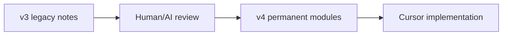

# v3 to v4 Migration Map

This file explains why the v4 vault is still compatible with v3 while freezing a cleaner structure.

## Why v3 is preserved

The v3 vault contained many useful scientific and architecture notes. They are preserved in `_legacy_v3_reference/` so no content is lost.

## Active architecture

The active structure is the v4 root:

- `04_Human_Understanding_Engine/` replaces scattered assessment, voice intake, sensor, and AI hypothesis notes.
- `05_Therapeutic_Engine/` collects target and session planning logic.
- `06_Music_Engine/` collects music generation and session music logic.
- `07_AI_Core/` defines orchestration and model routing.
- `19_Inbox/` is the only place for raw new ideas.
- `20_Workbench/` is the only place for active restructuring before permanent docs.

## Cursor instruction

Cursor must prioritize root-level v4 files. The legacy folder is reference-only.

