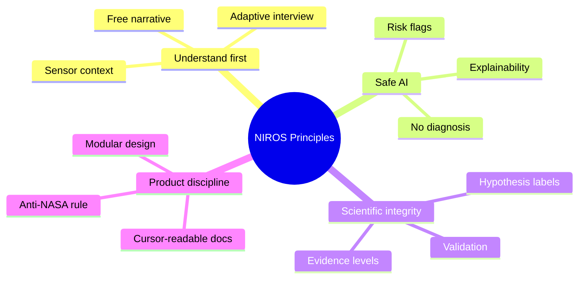

# NIROS Design Principles

These principles are permanent unless a formal ADR changes them.

1. **Human understanding before intervention.** NIROS must first understand the person before suggesting any session, music, protocol, or therapeutic direction.
2. **AI does not diagnose.** AI forms hypotheses, confidence estimates, risk flags, and suggested next questions. Medical diagnosis belongs to licensed clinicians.
3. **Declared problem is not automatically the real target.** If a person says “I have depression,” NIROS must validate whether depression is primary, secondary, or only the language the person currently has for distress.
4. **Structured freedom.** The conversation should feel natural, but the engine must run inside explicit state machines and safety rules.
5. **Evidence and speculation are separated.** Every scientific claim must be tagged as established evidence, plausible inference, design hypothesis, or open question.
6. **Sensors are supportive, not decisive.** HRV, EDA, sleep, voice, face, or breathing data can guide questions but must not be treated as a lie detector or standalone diagnostic proof.
7. **Explainability is mandatory.** Each important AI output should include why it was produced, what evidence supported it, and what would change the conclusion.
8. **Privacy by design.** The system should minimize raw sensitive data retention and prefer structured summaries when possible.
9. **Modular architecture.** Each module must be replaceable: interview, hypothesis, risk, music, sensors, and therapeutic planning should not be hard-coupled.
10. **No endless expansion.** New ideas go through Inbox → Workbench → Review before becoming permanent architecture.

## Principle map

