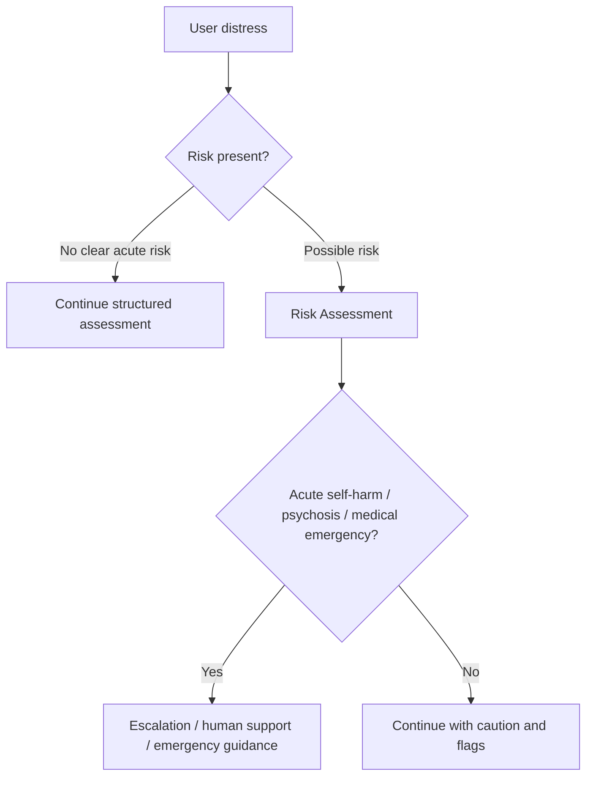

# Project Boundaries

## NIROS is

- A research operating system for designing adaptive human-understanding workflows.
- A future product architecture for guided intake, support, preparation, integration, and personalized session design.
- A structured AI assistant that can ask questions, summarize, form hypotheses, and recommend human review when needed.

## NIROS is not

- A replacement for a doctor, psychotherapist, psychiatrist, or emergency service.
- A free-form chatbot that invents therapy without constraints.
- A diagnostic authority.
- A psychedelic protocol engine without safety, screening, consent, and human oversight.

## Hard boundaries

## Cursor note

All implementation must preserve these boundaries in prompts, APIs, UI copy, and model outputs.
