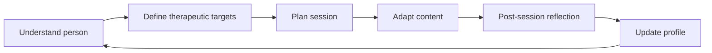

# Product Thesis

NIROS exists because most mental-health and altered-state support systems start too late. They jump quickly to protocols, content, or advice before deeply understanding the person.

The core bet:

> A system that combines natural conversation, structured clinical reasoning, physiological context, and adaptive content generation can create better preparation, safer personalization, and more meaningful integration.

## Product loop

## First real product target

Build the **Human Understanding Engine MVP** before anything else.

Minimal scope:

- Text conversation intake
- Declared problem capture
- Adaptive follow-up questions
- Risk screen
- Structured profile JSON
- Human-readable summary
- Export for review
