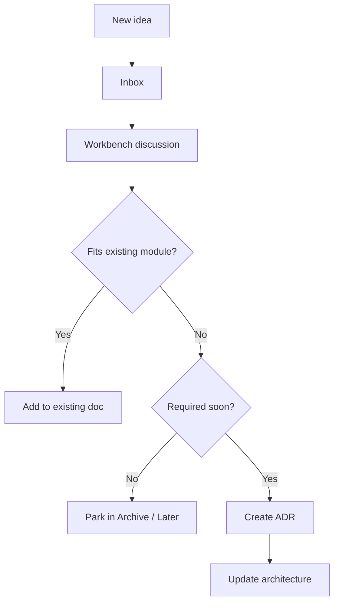

# Anti-NASA Rule

NIROS can easily expand into everything: psychology, music, wearables, psychedelics, AI agents, neuroscience, dashboards, hardware, research databases, and clinical tools.

That is dangerous.

## Rule

No new top-level module is added unless:

1. The idea cannot fit inside an existing module.
2. It is required for the next implementation phase.
3. It has been discussed in Workbench.
4. It has an ADR.

## Default answer to new ideas

New ideas do not change architecture. They go to [[19_Inbox/01_New_Ideas]].

## Decision flow

