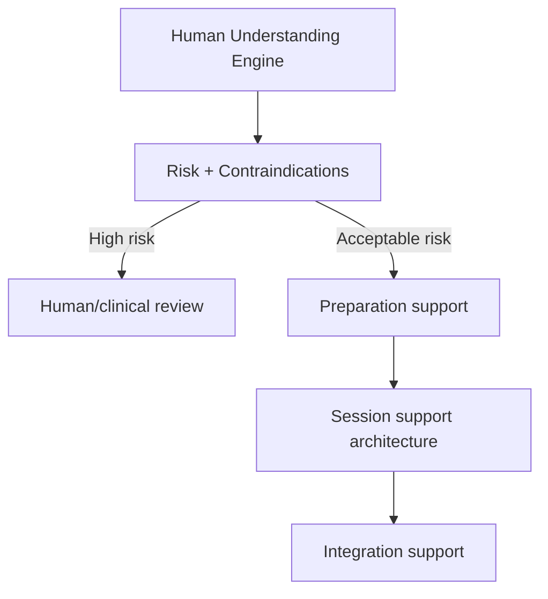

# Psychedelic-Assisted Therapy Notes

This document stores high-level scientific and product architecture notes. It must not become a dosing manual or unsupervised-use guide.

## Relevant domains

- Preparation
- Screening and contraindications
- Set and setting
- Therapeutic alliance
- Music and emotional arc
- Integration
- Adverse event monitoring

## NIROS stance

NIROS should focus on:

1. Structured preparation.
2. Risk screening.
3. Human understanding.
4. Integration support.
5. Research documentation.

It should not autonomously recommend substance use or replace licensed supervision.

## Architecture implication

