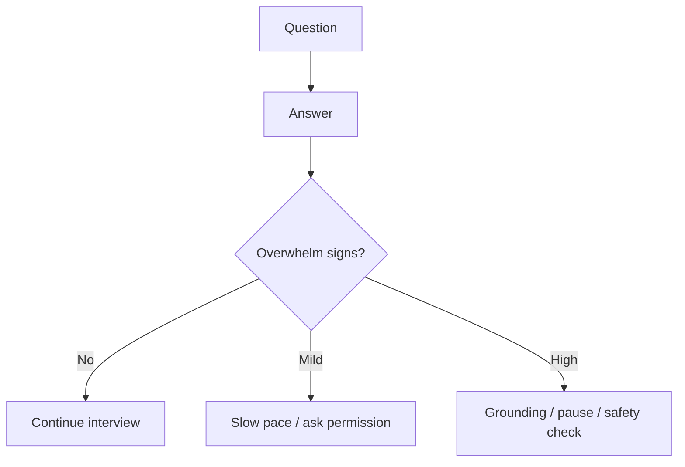

# Trauma-Informed Care

Trauma-informed design means NIROS must avoid forcing disclosure, avoid surprise intensity, respect control, and preserve the user's agency.

## Product rules

- Ask permission before deeper questions.
- Allow skipping any question.
- Avoid graphic detail prompts unless clinically necessary and supervised.
- Detect signs of overwhelm.
- Use grounding options when arousal rises.
- Never frame resistance as failure.

## Interview implication

