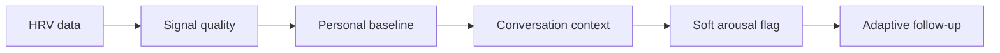

# HRV and Arousal

HRV can provide context about autonomic regulation, stress load, recovery, and arousal patterns. It must not be treated as a diagnostic marker by itself.

## NIROS use

- Establish personal baseline.
- Detect shifts during sensitive topics.
- Adjust session intensity.
- Support follow-up questions.
- Track recovery after sessions.

## Wrong uses

- Lie detection.
- Standalone diagnosis.
- Universal threshold without personal baseline.
- Ignoring confounders such as sleep, caffeine, illness, exercise, medication, and measurement quality.

## Sensor interpretation flow

