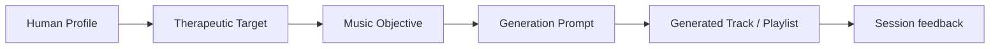

# Music and State Modulation

Music in NIROS is not decoration. It is a state-shaping layer that may support emotional access, safety, movement through phases, and integration.

## Music variables

- Tempo
- Timbre
- Harmonic density
- Repetition
- Vocal presence
- Cultural familiarity
- Emotional valence
- Dynamic intensity
- Silence and spacing

## Design implication

The Music Engine should receive therapeutic targets from the Therapeutic Engine, not guess them from a generic mood label.

