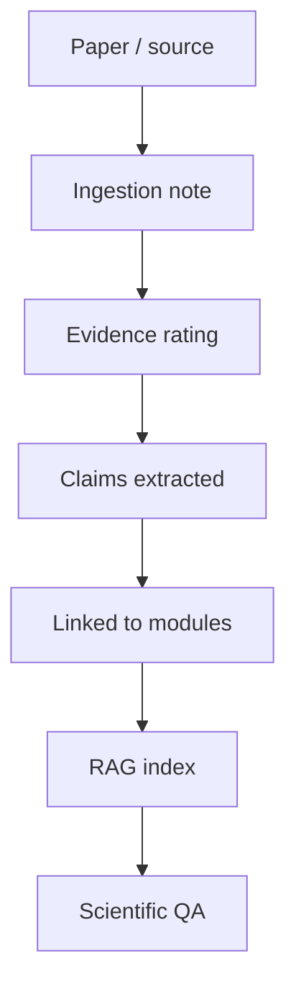

# RAG Standards

NIROS should use retrieval-augmented knowledge only when sources are tracked, rated, and separated from product hypotheses.

## Required metadata

```yaml
title:
authors:
year:
doi_or_url:
domain:
evidence_level:
summary:
key_findings:
limitations:
relevance_to_niros:
```

## RAG rule

The AI must never cite an unread or weak source as if it proves a strong clinical claim.

## Knowledge flow


