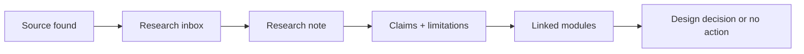

# Paper Ingestion Pipeline

## Workflow

1. Add paper or link to [[19_Inbox/02_Research_To_Read]].
2. Create a research note using [[18_Templates/Research Paper Template]].
3. Assign evidence level.
4. Extract claims and limitations.
5. Link to relevant module.
6. Add implementation implications only if justified.

## Mermaid

