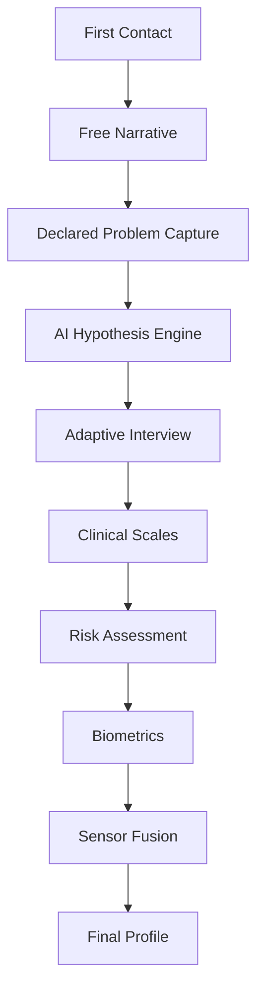

# Human Understanding Engine Overview

The Human Understanding Engine is the first core module of NIROS. It transforms a person's free narrative, structured answers, safety signals, and optional biometric context into a structured human profile.

## Why it exists

A person often arrives with a declared problem: “depression,” “anxiety,” “trauma,” “burnout,” “I feel lost.” NIROS must not assume that the declared label is the true therapeutic target.

## Main outputs

- Declared problem
- Confirmed / likely therapeutic targets
- Competing hypotheses with confidence estimates
- Risk flags
- Readiness estimate
- Sensor context if available
- Final structured profile JSON
- Human-readable summary

## Engine map

## MVP boundary

The first MVP should be text-based. Voice comes after the state machine is working.

## Related

- [[03_Adaptive_Interview/00_Adaptive_Interview_Overview]]
- [[05_AI_Hypothesis_Engine/00_AI_Hypothesis_Engine_Overview]]
- [[09_Biometrics/00_Biometrics_Overview]]
- [[../10_Safety_and_Ethics/00_Safety_Ethics_Overview]]
