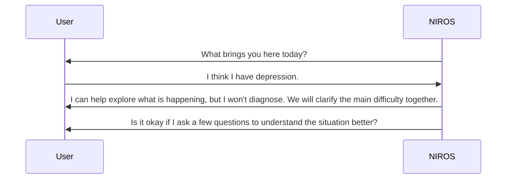

# First Contact

First contact defines the user's initial experience and sets boundaries before any deep assessment.

## Goals

- Establish consent.
- Explain what NIROS can and cannot do.
- Capture the person's declared reason for coming.
- Avoid overpromising.
- Start safety screening gently.

## Example opening flow

## Required fields

- consent_status
- declared_problem_text
- preferred_language
- urgency_level
- safety_warning_present
