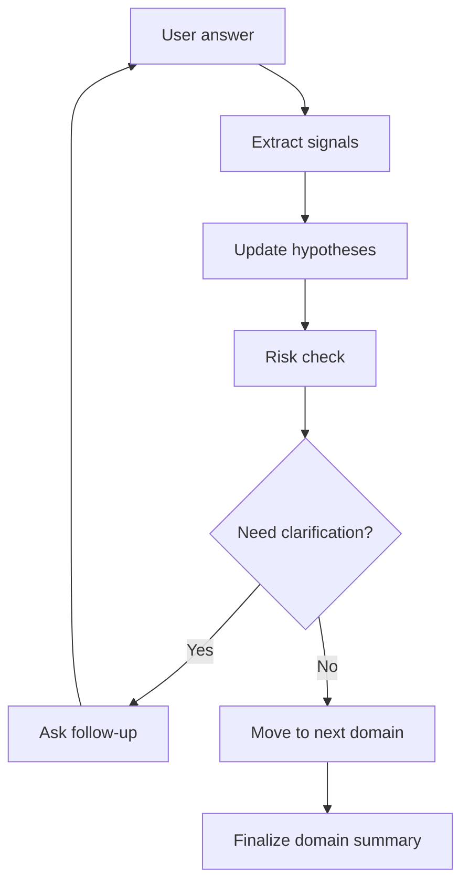

# Adaptive Interview Overview

The adaptive interview is the practical MVP heart of NIROS.

It is not a free chatbot. It is a structured state machine that uses AI to choose the next best question based on the user's previous answers.

## Core idea

## Why this is feasible

The AI does not need to invent the whole interview. It chooses from a library and generates natural wording inside constraints.

## Cost control

- Use structured summaries instead of full conversation memory.
- Use small models for classification when possible.
- Use larger models only for complex synthesis.
- Avoid continuous voice streaming in MVP.
