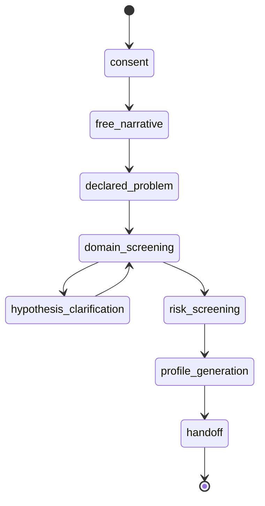

# Interview State Machine

## States

| State | Purpose |
|---|---|
| consent | Confirm user understands boundaries |
| free_narrative | Let the person speak freely |
| declared_problem | Capture user's own label |
| domain_screening | Ask structured blocks |
| hypothesis_clarification | Ask discriminating follow-ups |
| risk_screening | Detect safety concerns |
| profile_generation | Produce final structured profile |
| handoff | Send to next module |

## Mermaid

## Transition rule

A transition should require either:

- enough confidence,
- domain completion,
- risk interruption,
- user request to pause,
- or maximum question count reached.
