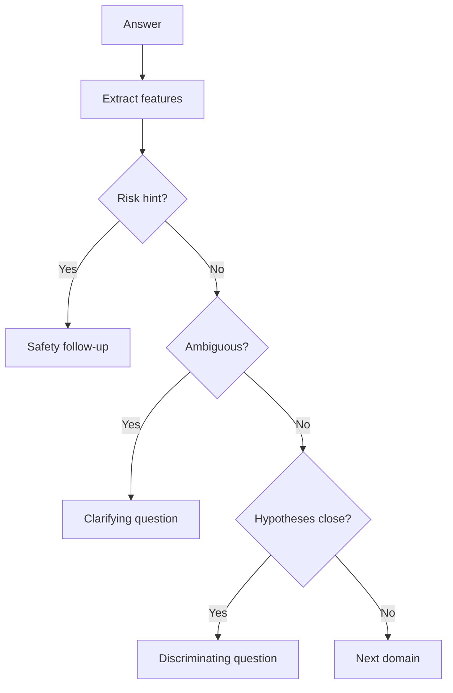

# Dynamic Follow-up Rules

Follow-up questions should be selected because they reduce uncertainty.

## Follow-up triggers

- Ambiguous answer
- Strong emotional marker
- Contradiction between declared problem and evidence
- Risk hint
- Missing timeline
- Missing functional impact
- Sensor arousal shift

## Selection logic

## Example

If the person says “I feel empty,” possible follow-ups:

- mood: “How long has that feeling been present?”
- grief: “Did it begin after a loss or major change?”
- burnout: “Does it improve when you are away from obligations?”
- risk: “When you say empty, do you mean emotionally numb, or that you do not want to be alive?”
