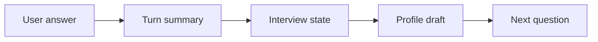

# Conversation Memory

The interview engine should not rely on raw transcript alone.

## Memory layers

1. Raw transcript — optional, sensitive, may be short-lived.
2. Turn summary — compact summary per answer.
3. Structured state — fields used by the state machine.
4. Profile summary — final durable output.

## Recommended MVP

Store:

- transcript during session,
- compact turn summaries,
- structured profile after session.

Do not store unnecessary raw sensitive data by default.

## Memory update flow

