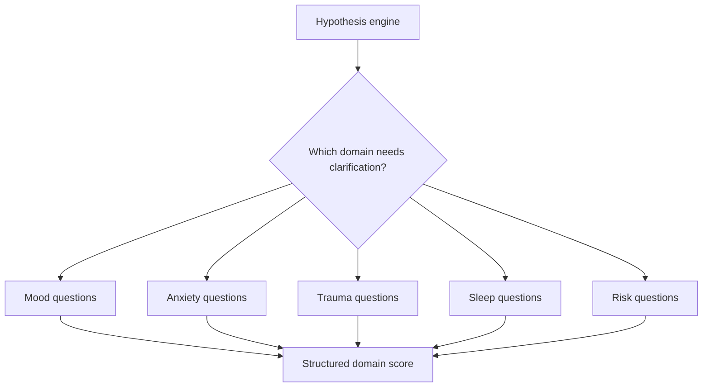

# Clinical Scales

Clinical scales provide structured signals. They are not the whole assessment.

## MVP approach

For early NIROS versions, use scale-inspired domains rather than claiming validated clinical scoring unless the exact instrument is implemented and licensed/appropriate.

## Domains

- Mood
- Anxiety
- Sleep
- Energy
- Appetite
- Concentration
- Trauma symptoms
- Substance use
- Social function
- Suicidality / self-harm risk

## Flow

