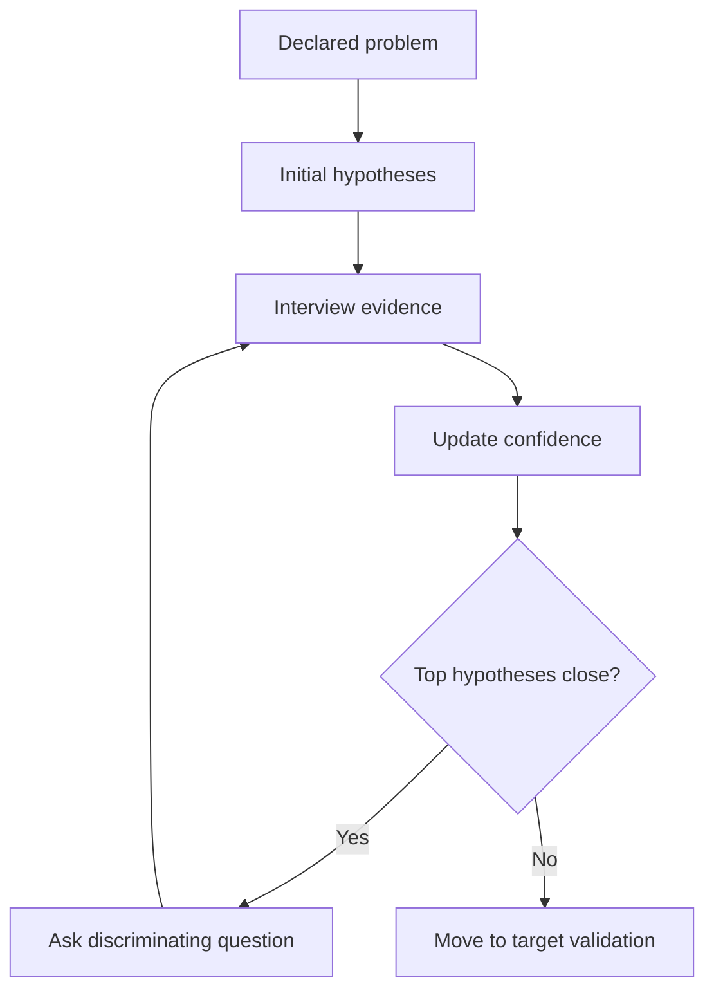

# AI Hypothesis Engine Overview

The AI Hypothesis Engine tracks possible explanations for the person's difficulties and decides what information would be most useful next.

## It does not diagnose

It produces working hypotheses such as:

- depressive syndrome pattern
- generalized anxiety pattern
- burnout / chronic overload pattern
- trauma-related pattern
- grief-related pattern
- substance-related risk
- acute safety concern

## Flow



## Output example

```yaml
hypotheses:
  - name: burnout_chronic_overload
    confidence: 0.78
    evidence_for: []
    evidence_against: []
    next_best_question: burnout_recovery_001
```
