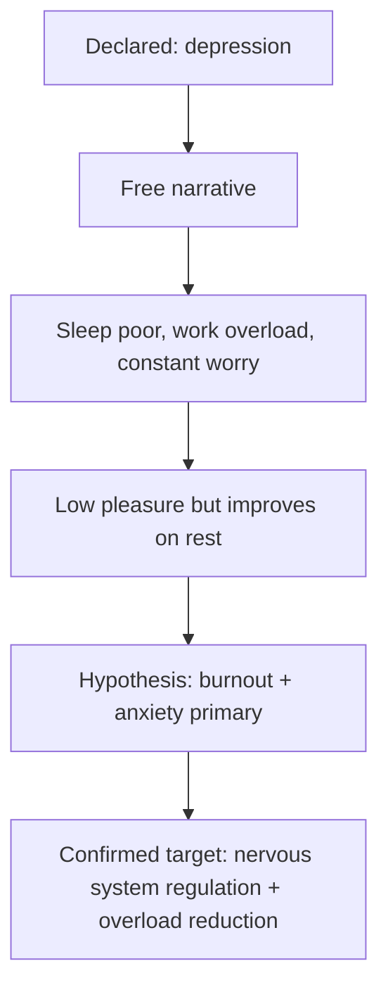

# Declared vs Confirmed Problem

The declared problem is what the person says. The confirmed problem is the system's working target after structured clarification.

## Example

## User-facing output

Use soft language:

> “Your original word was depression. The pattern we found also shows strong anxiety and overload. The first working target may be overload and regulation, with mood symptoms tracked as part of that.”
