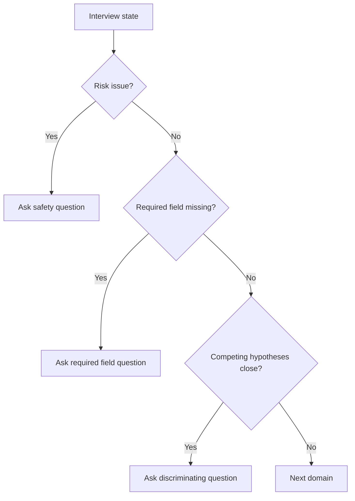

# Next Best Question

The next best question is selected to reduce uncertainty or manage risk.

## Priority order

1. Safety concern
2. Consent / user control
3. Missing required profile field
4. Clarify top competing hypotheses
5. Deepen therapeutic target
6. Move to next domain

## Selection flow

