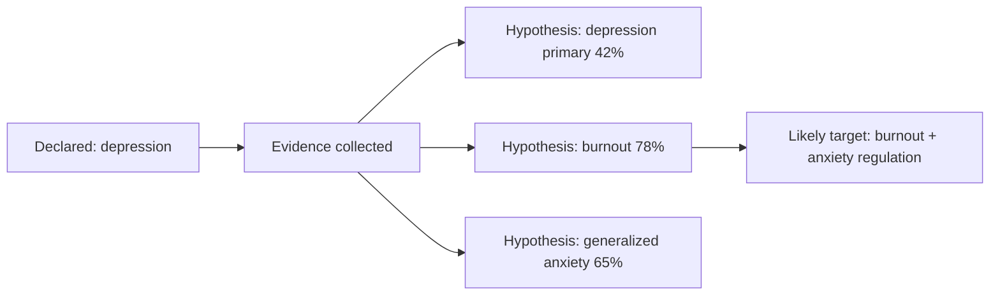

# Problem Validation

Problem validation compares what the person says they came for with what the system infers from the full assessment.

## Key concepts

- **Declared Problem:** the user's own label.
- **Confirmed Therapeutic Target:** the most likely focus after interview and evidence.
- **Secondary Symptom:** a real symptom that may be caused by another primary factor.
- **Unclear / needs human review:** insufficient confidence or safety concern.

## Example

## User-facing language

NIROS should never say: “You are wrong.”

Better:

> “You came describing depression. Based on your answers, depression-like symptoms are present, but the strongest pattern appears to be chronic overload and anxiety. We can treat this as the first working hypothesis.”
