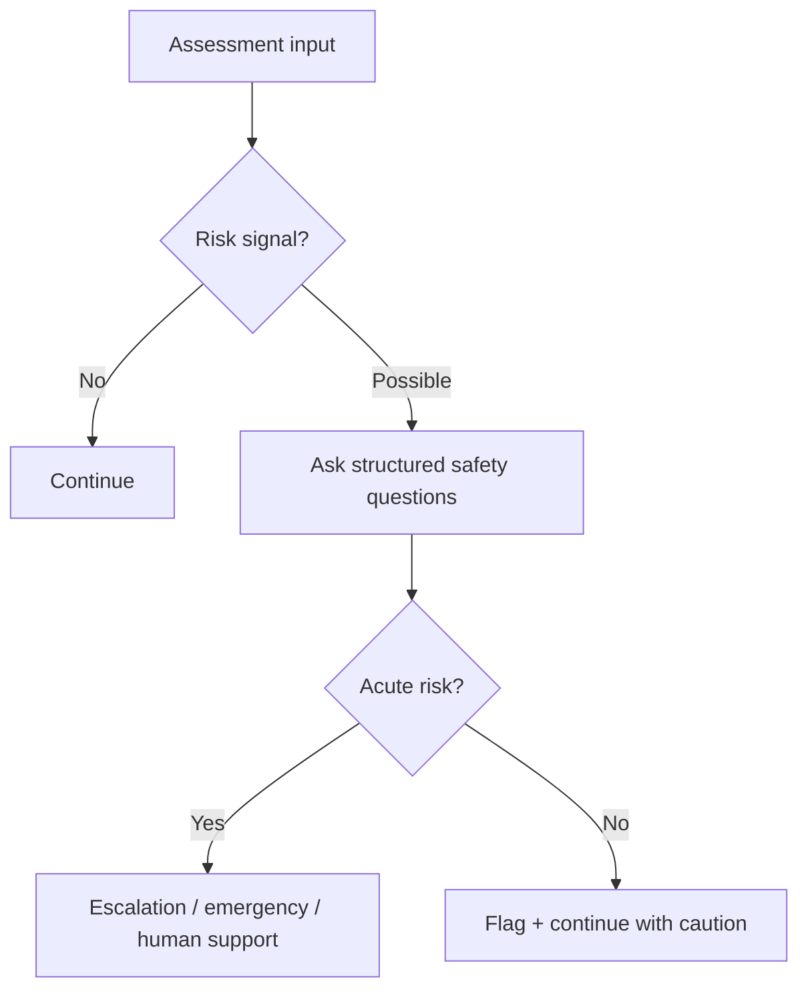

# Risk Assessment

Risk assessment is mandatory before any therapeutic recommendation.

## Risk categories

- Acute self-harm or suicidal intent
- Psychosis or mania indicators
- Severe dissociation / destabilization
- Substance dependence or intoxication
- Medical instability
- Unsafe environment
- Coercion or lack of consent

## Risk flow

## Cursor implementation note

Risk checks should run before generating deep follow-up questions.
