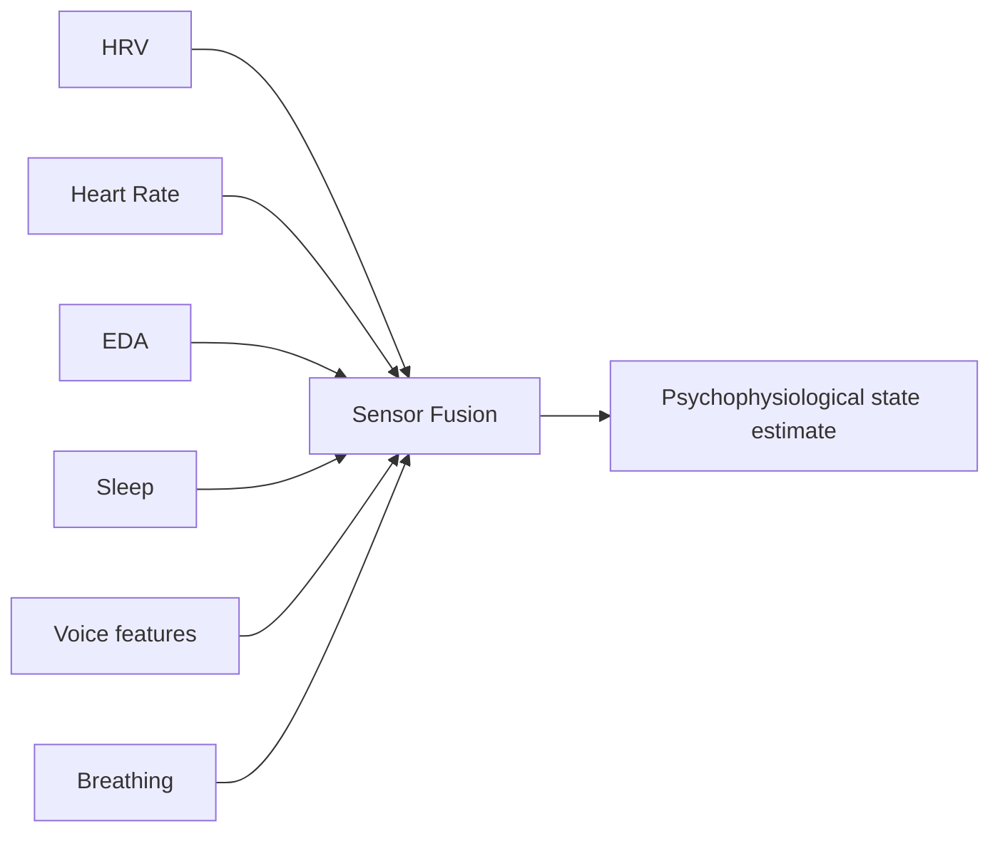

# Sensor Fusion

Sensor Fusion combines multiple physiological signals with conversation context.

## Inputs

## Outputs

- arousal_level
- recovery_status
- stress_response_flag
- signal_quality
- confidence
- suggested_interview_adjustment

## Safety

Never present sensor interpretation as certainty.
