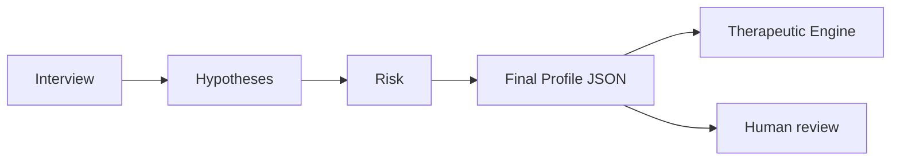

# Final Profile

The final profile is the handoff object from Human Understanding Engine to Therapeutic Engine.

## Must include

- Summary
- Main hypotheses and confidence
- Declared vs confirmed problem
- Risk flags
- Readiness score
- Sensor context if available
- Recommended next steps
- Human review requirement

## Handoff flow

