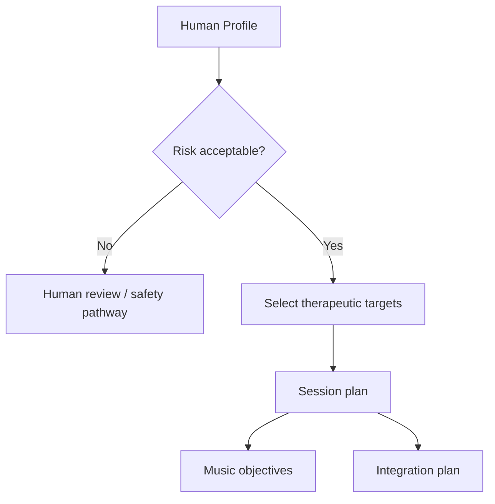

# Therapeutic Engine Overview

The Therapeutic Engine converts the final human profile into safe, explainable therapeutic targets and session plans.

## Inputs

- Final Human Profile
- Risk flags
- Readiness score
- Confirmed therapeutic targets
- User preferences
- Contraindications

## Outputs

- therapeutic_targets
- session_objectives
- preparation_tasks
- integration_tasks
- music_objectives
- human_review_required

## Flow

## MVP boundary

For early implementation, Therapeutic Engine should produce planning summaries, not medical treatment instructions.
