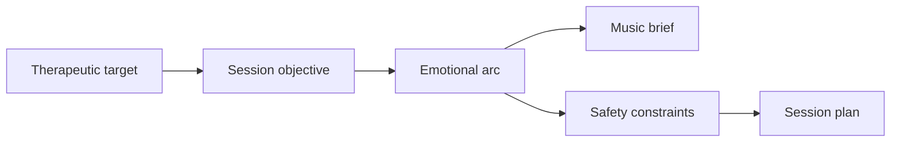

# Session Planning

Session planning translates targets into a structured experience.

## Components

- preparation focus
- emotional intensity level
- music arc objective
- grounding options
- integration prompts
- stop / pause rules

## Flow

