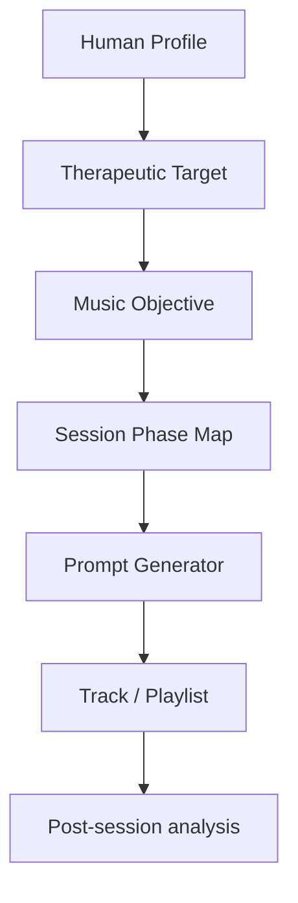

# Music Engine Overview

The Music Engine converts therapeutic objectives into music briefs, playlists, or generation prompts.

## It receives

- human profile
- therapeutic target
- intensity limits
- cultural preferences
- contraindications
- session phase

## It outputs

- music objective
- prompt for generation
- playlist structure
- phase map
- safety notes

## Flow

