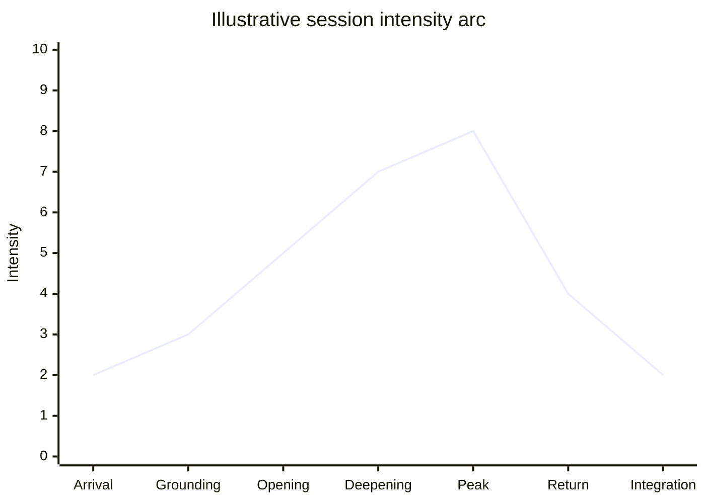

# Session Music Arc

The music arc should follow the therapeutic plan, not a generic cinematic structure.

## Rule

If the profile contains high dysregulation or trauma instability, the arc should avoid aggressive intensity escalation.
