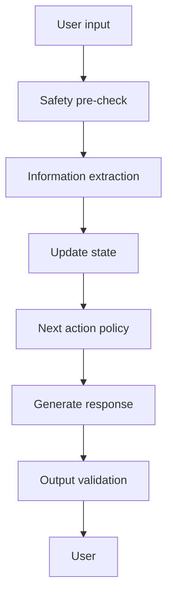

# AI Core Overview

AI Core coordinates models, prompts, memory, safety, and module calls.

## Responsibilities

- Route tasks to the right model.
- Maintain state machine boundaries.
- Generate natural wording from structured intent.
- Extract structured information.
- Run safety checks before deepening.
- Produce explainable outputs.

## Orchestration

