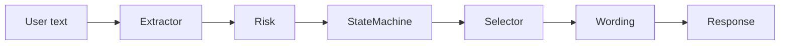

# Orchestration Pattern

NIROS should avoid one giant prompt.

## Recommended pattern

- Extractor: turns language into structured fields.
- Risk checker: detects safety issues.
- State machine: decides allowed next state.
- Question selector: chooses next intent.
- Wording model: makes the question natural.
- Summarizer: updates compact memory.

## Diagram

