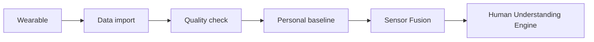

# Sensors Overview

Sensors are a later module. Do not block the MVP on hardware.

## Sensor priority

1. Sleep and activity data
2. Heart rate / HRV
3. Voice features
4. Breathing
5. EDA
6. EEG only much later

## Architecture

