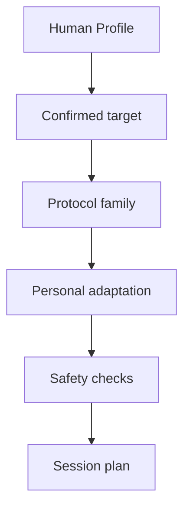

# Clinical Protocols Overview

Clinical protocols organize target domains. They do not replace clinical care.

## Candidate protocol families

- Depression-like symptoms
- Anxiety and worry
- Burnout and overload
- Trauma-related patterns
- Grief and loss
- Addiction / compulsive patterns
- Existential distress
- Integration support

## Protocol flow

