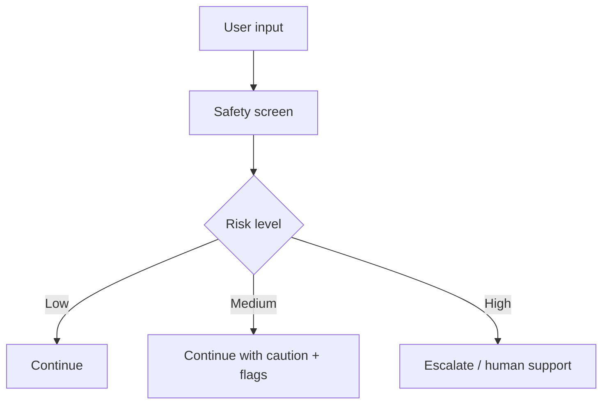

# Safety and Ethics Overview

Safety is not a module added later. It is a constraint across the whole system.

## Main safety layers

- Consent
- Scope explanation
- Risk screening
- Crisis escalation
- Human review triggers
- Data minimization
- Explainability
- Bias and cultural humility

## Safety graph

