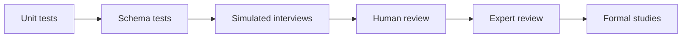

# Validation Overview

NIROS must be validated at each layer before claiming usefulness.

## Validation layers

1. Technical correctness
2. Schema validity
3. Interview coherence
4. Safety behavior
5. Human review quality
6. Clinical expert review
7. Outcome studies later

## Flow

