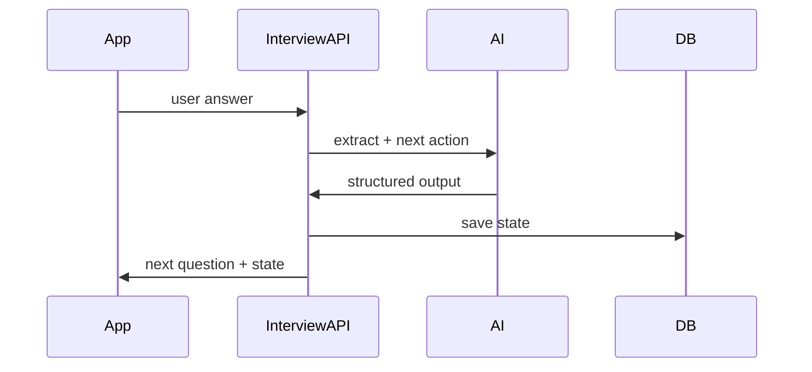

# SDK and API Overview

This module defines stable interfaces for code implementation.

## Core objects

- HumanProfile
- InterviewState
- HypothesisSet
- RiskAssessment
- SensorSnapshot
- SessionPlan
- MusicBrief

## API flow

