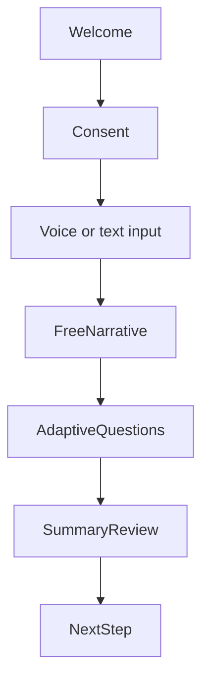

# UI / UX Overview

NIROS UI should feel calm, clear, and non-clinical while preserving seriousness.

## UX principles

- User always knows why a question is being asked.
- User can pause or skip.
- The interface shows progress without creating pressure.
- Risk or uncertainty is handled gently.
- Summaries are editable by the user.

## Intake screen flow

