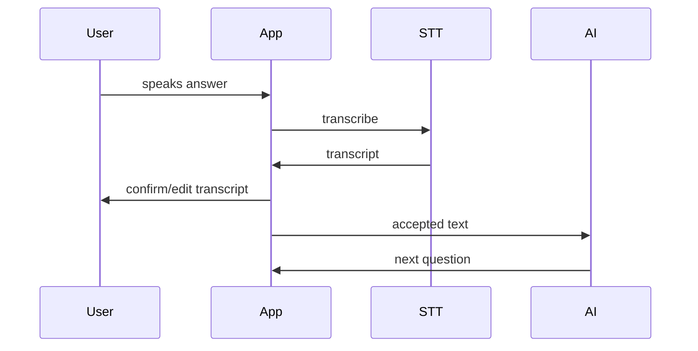

# Voice Intake UX

Voice intake should not be implemented as continuous pressure to talk.

## Recommended UX

- Push-to-talk for MVP.
- Clear transcript preview.
- User can edit transcription.
- AI confirms important facts.
- Sensitive answers can be typed instead.

## Voice loop

