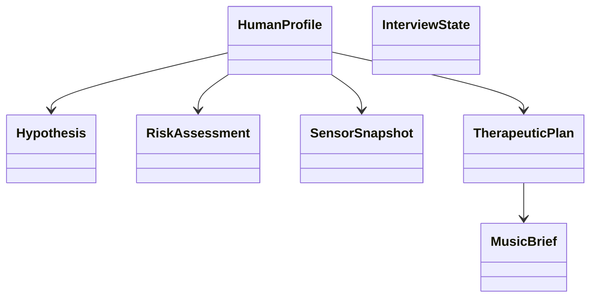

# Data Model Overview

The data model defines the canonical objects NIROS uses across modules.

## Main objects

```mermaid
classDiagram
    class HumanProfile
    class InterviewState
    class Hypothesis
    class RiskAssessment
    class SensorSnapshot
    class TherapeuticPlan
    class MusicBrief
    HumanProfile --> Hypothesis
    HumanProfile --> RiskAssessment
    HumanProfile --> SensorSnapshot
    HumanProfile --> TherapeuticPlan
    TherapeuticPlan --> MusicBrief
```
