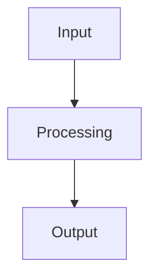

# Module Spec Template

## Purpose

## Inputs

## Outputs

## State machine / flow

```mermaid
flowchart TD
    A[Input] --> B[Processing]
    B --> C[Output]
```

## Safety constraints

## Data schema

## Tests

## Related modules
