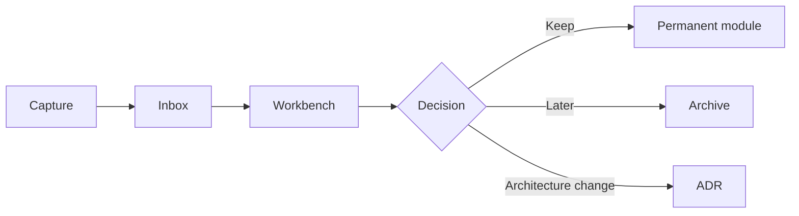

# Capture Rules

This is how new ideas enter NIROS without breaking the architecture.

## Where to put things

| Input type | File |
|---|---|
| New product idea | [[01_New_Ideas]] |
| Paper or source to read | [[02_Research_To_Read]] |
| Unresolved conceptual question | [[03_Open_Questions]] |
| Feature request | [[04_Features]] |
| Random thought | [[05_Random_Thoughts]] |
| Dictated note | [[06_Voice_Notes]] |

## Processing rule

New ideas are not immediately added to permanent modules.

## How to use with ChatGPT

At the beginning of a new chat, upload the vault and say:

> Work from NIROS v4 Foundation Release. First check Inbox and Workbench before changing permanent architecture.

## How to use with Cursor

Cursor should read `.cursor/NIROS_CURSOR_CONTEXT.md` and this file before making broad changes.
