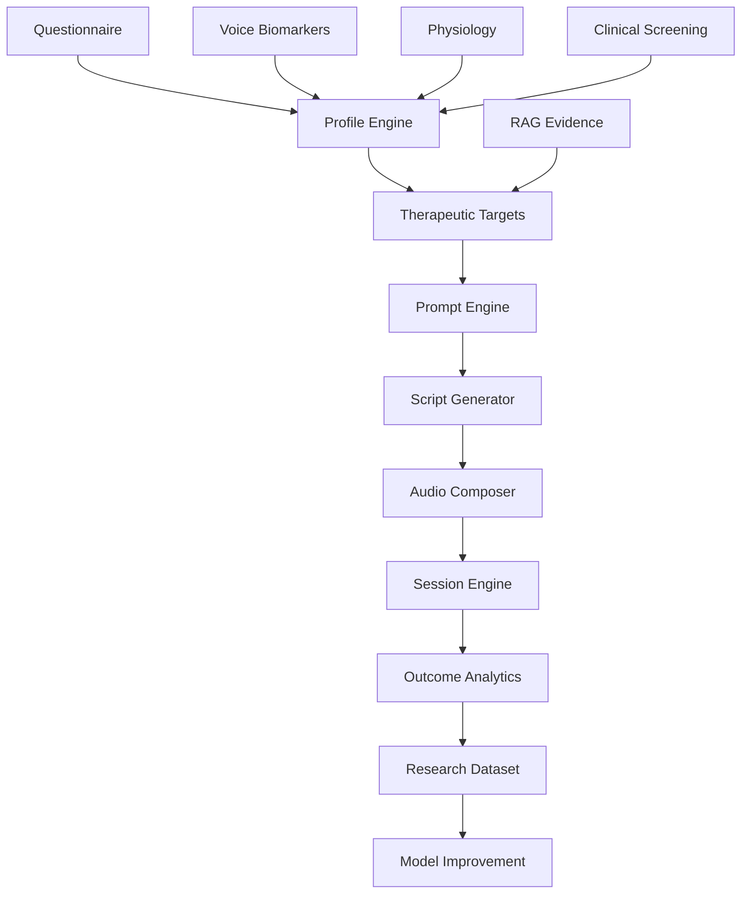

# Module Dependency Graph

```mermaid
graph TD
    A[Questionnaire] --> D[Profile Engine]
    B[Voice Biomarkers] --> D
    C[Physiology] --> D
    E[Clinical Screening] --> D
    D --> F[Therapeutic Targets]
    G[RAG Evidence] --> F
    F --> H[Prompt Engine]
    H --> I[Script Generator]
    I --> J[Audio Composer]
    J --> K[Session Engine]
    K --> L[Outcome Analytics]
    L --> M[Research Dataset]
    M --> N[Model Improvement]
```

Each module must have: purpose, inputs, outputs, dependencies, risks, validation plan, and future version.
