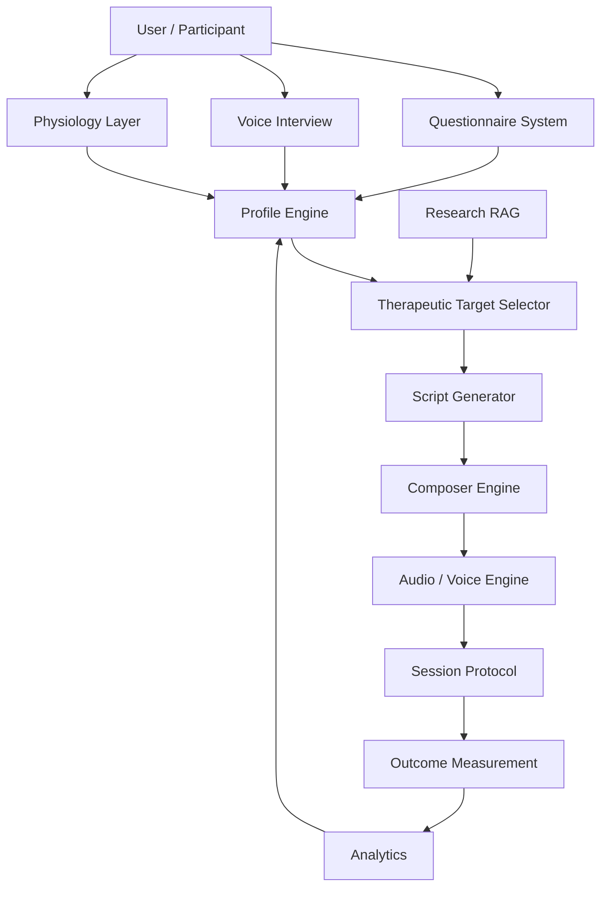

# System Architecture Map

## High-level architecture

## Key subsystems

- [[05_Profile_Engine/Profile Engine Overview]]
- [[06_Questionnaire_System/Questionnaire Overview]]
- [[07_Voice_and_Speech_Analysis/Voice Analysis Overview]]
- [[08_Physiology_Layer/Physiology Layer Overview]]
- [[04_Research_RAG/RAG System Overview]]
- [[11_NeuroIcaro_Composer/Composer Overview]]
- [[13_Session_Engine/Session Protocol Overview]]
