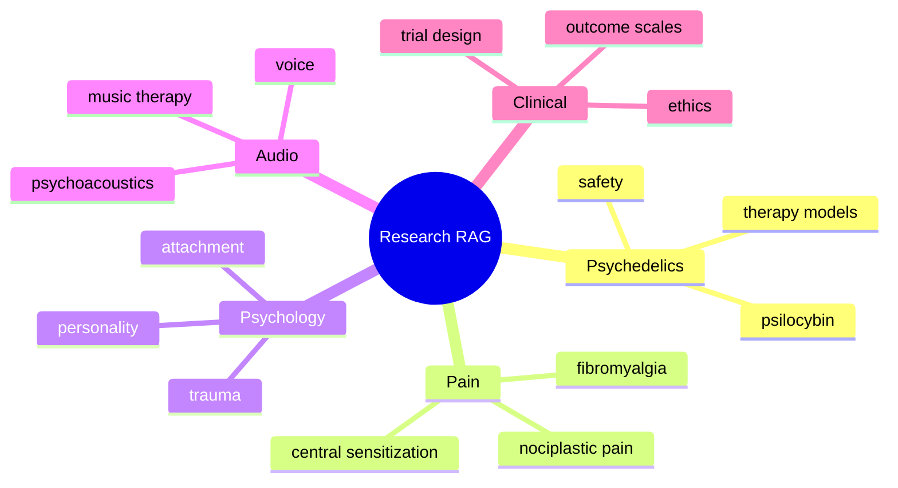

# RAG System Overview

## Purpose

The RAG system grounds NeuroIcaro outputs in scientific literature and prevents the platform from inventing unsupported clinical claims.

## Knowledge categories

## Output labels

- Evidence supported
- Plausible but unproven
- Speculative
- Contraindicated
- Unknown
