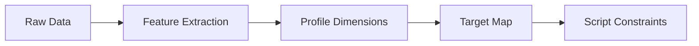

# Profile Engine Overview

## Purpose

The Profile Engine builds a structured digital model of a person for therapeutic personalization.

It should not claim to capture the entire subconscious. It should capture actionable dimensions relevant to safety, language, emotion, pain, identity, and session design.

## Inputs

- questionnaire answers;
- voice interview transcript;
- voice features;
- physiological signals;
- clinical screening;
- user preferences;
- contraindication flags.

## Outputs

- psychological profile;
- safety profile;
- language profile;
- symbolic profile;
- voice preference profile;
- therapeutic target map;
- script constraints.

