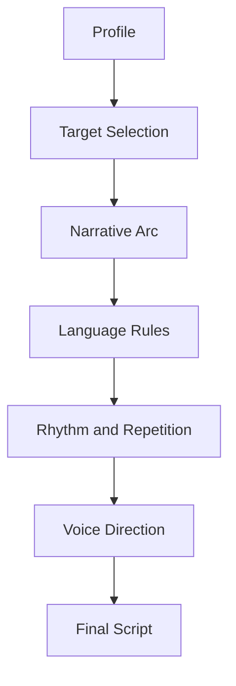

# Composer Overview

## Purpose

The Composer transforms profile data into a therapeutic script and song-like structure.

## Input

- profile summary;
- therapeutic targets;
- contraindicated phrases;
- voice preference;
- worldview profile;
- session stage;
- evidence constraints.

## Output

- opening grounding segment;
- emotional safety segment;
- body reinterpretation segment;
- symbolic transformation segment;
- integration seed segment;
- post-session integration prompts.

